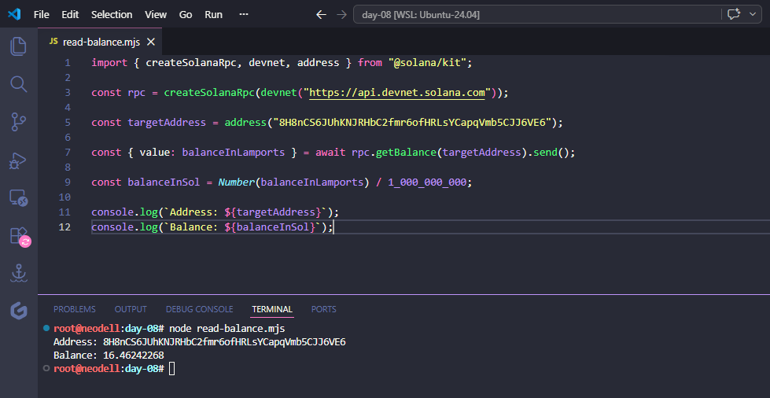

# Read your first on-chain data

## The Challenge

Connect to Solana’s devnet (the test network developers use for experimentation) and read the SOL balance of a public address.

You’ll install Solana’s JavaScript SDK, create a connection to devnet, and query the balance of a known address. That’s it. No wallet needed, no transactions, no tokens. Just a read operation against a public database.

