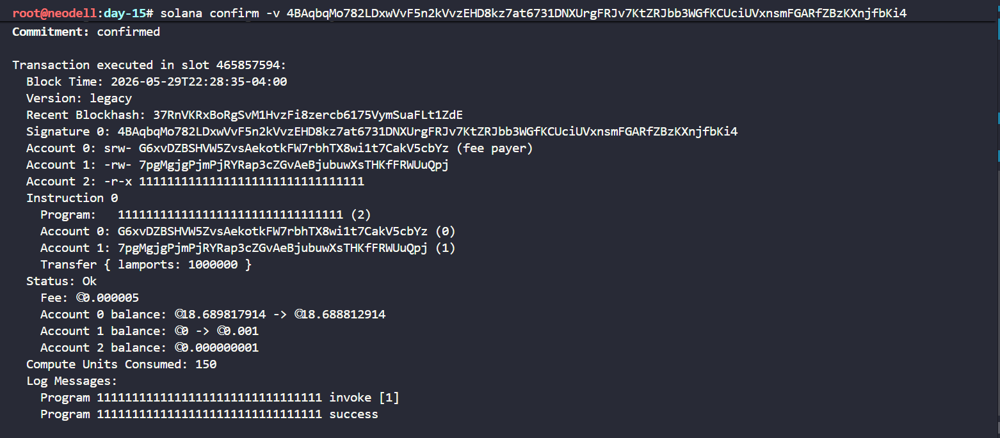
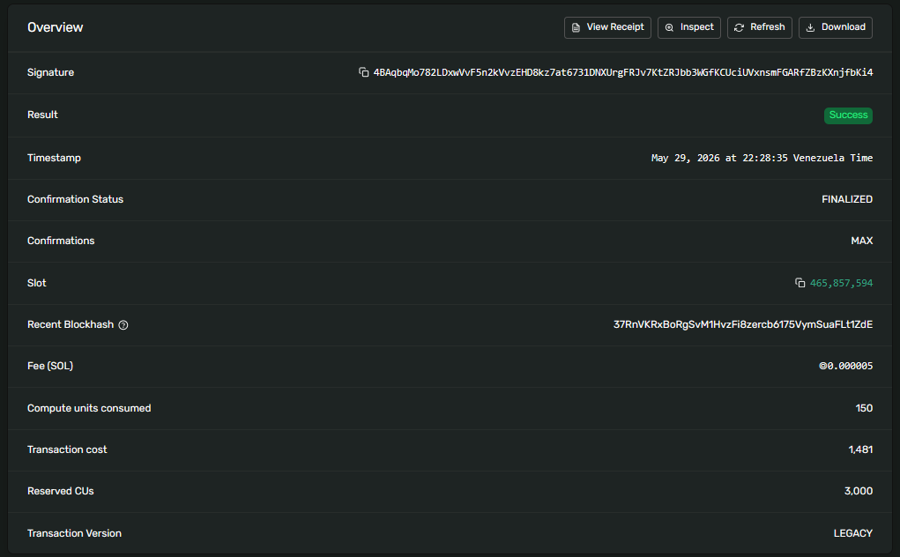
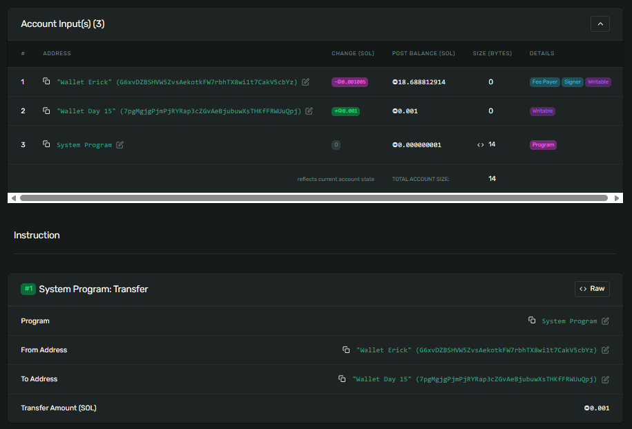
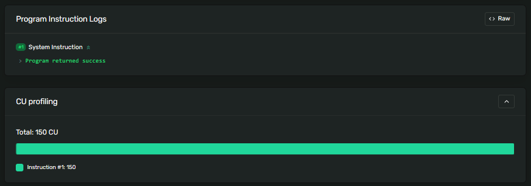

## Send a quick transfer on devnet so you have a transaction to inspect

solana-keygen new --no-bip39-passphrase -o wallet.json

solana transfer --allow-unfunded-recipient $(solana address -k wallet.json) 0.001 --url devnet

## Inspect the transaction with the CLI

solana confirm -v 4BAqbqMo782LDxwVvF5n2kVvzEHD8kz7at6731DNXUrgFRJv7KtZRJbb3WGfKCUciUVxnsmFGARfZBzKXnjfbKi4

