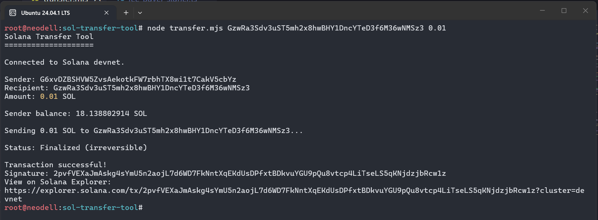

# Build a transfer tool

## Create a wallet for recipient 
solana-keygen new --outfile recipient.json --no-bip39-passphrase

## Wallet created
GzwRa3Sdv3uST5mh2x8hwBHY1DncYTeD3f6M36wNMSz3

## Execute transfer
node transfer.mjs GzwRa3Sdv3uST5mh2x8hwBHY1DncYTeD3f6M36wNMSz3 0.05

## Transaction Status

