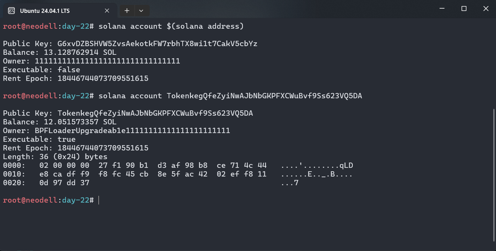
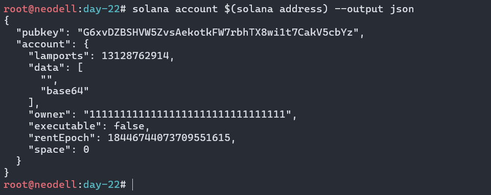

# Inspect account data

## The Challenge

Use the Solana CLI to inspect account data on devnet. You’ll examine your own wallet account, compare it to a program account, and start to see how Solana’s account model organizes everything on-chain.

First, make sure your CLI is pointed at devnet and confirm your wallet address:

```
solana config set --url https://api.devnet.solana.com
solana address
```

Copy the address that’s printed. This is the public key of your wallet account.

If your wallet is empty, give yourself some devnet SOL to work with:
```
solana airdrop 2
```

Now inspect your own wallet account:

```
solana account $(solana address)
```



You should see output that looks something like this:

```
Public Key: YourWa11etAddressHere...
Balance: 2 SOL
Owner: 11111111111111111111111111111111
Executable: false
Rent Epoch: 18446744073709551615
Length: 0 (0x0) bytes
```

Take note of each field. Your wallet is owned by the System Program (that long string of ones), it is not executable (it’s not a program), and it has 0 bytes of data (wallets don’t store custom data, just a SOL balance).

Now compare that to a program account. Inspect the SPL Token Program:

```
solana account TokenkegQfeZyiNwAJbNbGKPFXCWuBvf9Ss623VQ5DA
```

Notice the differences. This account has Executable: true, its owner is BPFLoader2111111111111111111111111111111111 (the program that loaded it), and the data field contains the compiled program bytecode.

Finally, look at the System Program itself:

```
solana account 11111111111111111111111111111111
```

This is a native built-in program. It’s the only program on Solana that can create new accounts. Compare its fields to what you saw in steps 3 and 4.

For a richer view, try inspecting your wallet account in JSON format:

```
solana account $(solana address) --output json
```



This gives you machine-readable output with the same fields: lamports, data, owner, executable, and rentEpoch. You can also paste your wallet address into the Solana Explorer to see the same information in a visual interface.