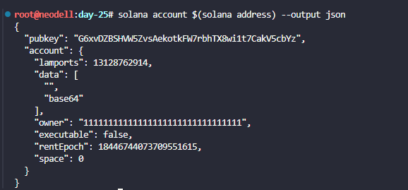
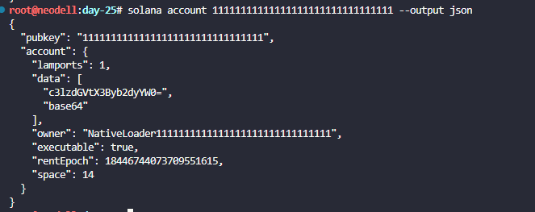
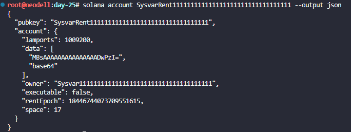

# Explore system program accounts

## The Challenge
You are going to use the Solana CLI and the Solana Explorer to inspect real accounts on devnet. You will examine system-owned accounts (wallets), look at native program accounts, peek at sysvar accounts, and compare how their fields differ. By the end, you will have a hands-on feel for the five fields every Solana account contains and what the System Program’s role is in managing them.

