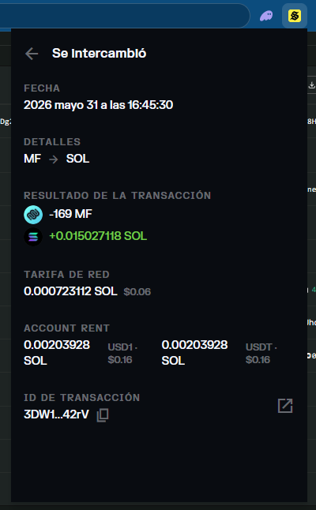
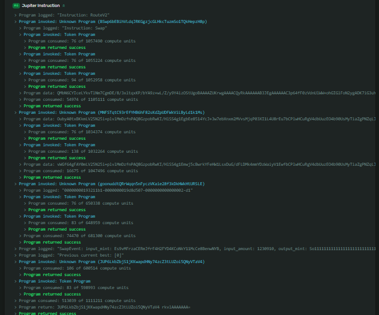

# Explore Solana Explorer

## The Challenge

Using Solana Explorer, find something interesting on devnet or mainnet and write a short explanation of what you found. This could be a large transaction, an active program, a wallet with unusual activity, a token you haven’t heard of, anything that catches your attention.

## 🔍 Auditing a Solana Swap

As part of the #100DaysOfSolana challenge, I decided to investigate one of my own transactions using Solana Explorer.

At first glance, it looked simple: I swapped 169 MF (Moonwalk Fitness) tokens for SOL.

But after inspecting the transaction, I discovered what was actually happening behind the scenes.

The swap involved:

• 59 accounts in the transaction
• 77 accounts referenced in the routing process
• 543,181 compute units consumed
• Multiple programs working together
• Temporary token accounts being created and closed automatically

What surprised me the most was that the swap wasn't a direct MF → SOL conversion.

Jupiter routed the trade through multiple assets to find the best available liquidity:

MF → USD1 → USDT → Wrapped SOL → SOL

Seeing the entire execution path in Solana Explorer gave me a much deeper appreciation for how sophisticated modern DeFi infrastructure has become.

A transaction that takes only a few seconds to complete can involve dozens of accounts, several protocols, and multiple token transfers, all executed transparently on-chain.

That's what caught my attention today while exploring Solana Explorer.

## Transaction in explorer

https://explorer.solana.com/tx/3DW1LgsjDg2cbgZnsPE4UkR4WqnZoZpwn5tufuRgKaAtV3FuujkCoHxQ4Lx3PfN6zRjL9tDoShJR8HsBR6DQ42rV
