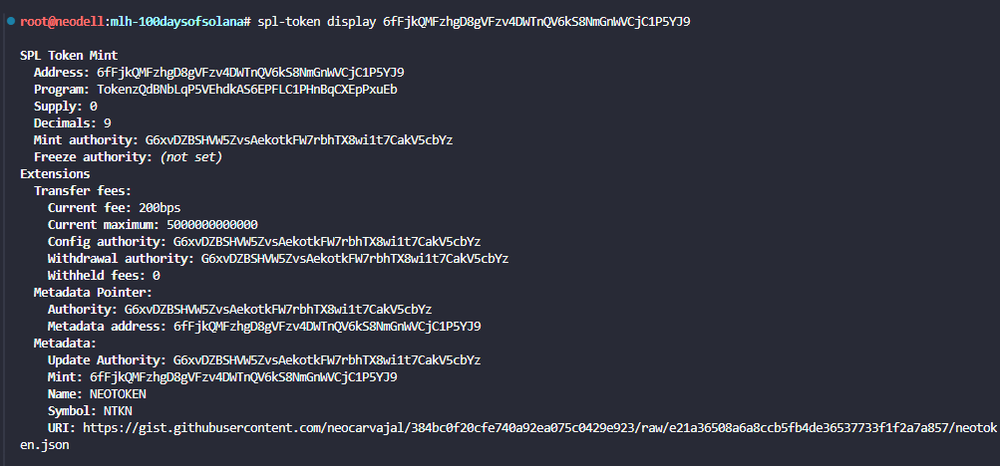
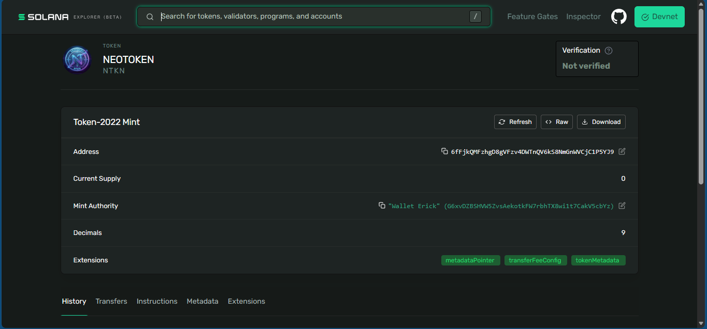
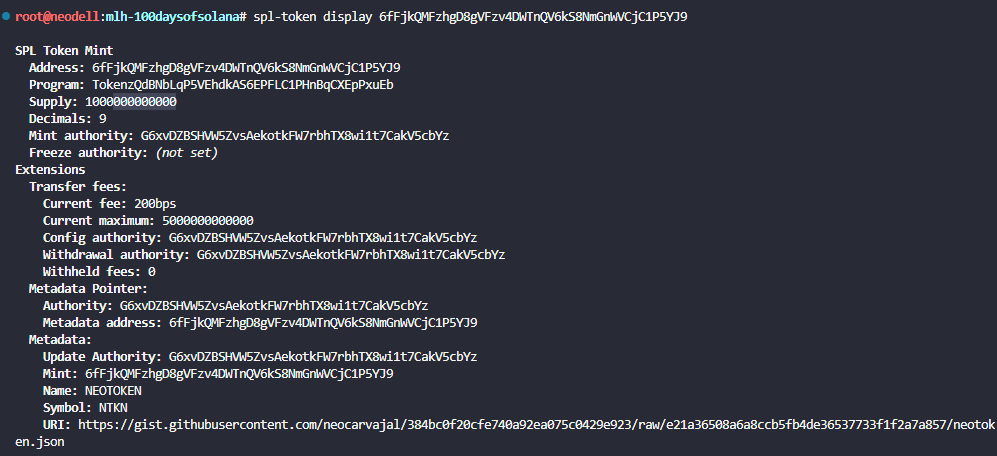

# Review token incentive mechanics

## Create token Mint with transfers fee

spl-token create-token --program-id TokenzQdBNbLqP5VEhdkAS6EPFLC1PHnBqCXEpPxuEb --transfer-fee-basis-points 200 --transfer-fee-maximum-fee 5000 --enable-metadata --decimals 9

Result:

```
Address:  6fFjkQMFzhgD8gVFzv4DWTnQV6kS8NmGnWVCjC1P5YJ9
Decimals:  9

Signature: 357cthSwxDVmhRKMbBuxndzYDtEhzEKtMnjz5yFPQbL3UZ9XGsL7z9DC6r35JbUxwkc2mLhnP53U34n4cCpLKYvJ
```

## Add metadata
spl-token initialize-metadata 6fFjkQMFzhgD8gVFzv4DWTnQV6kS8NmGnWVCjC1P5YJ9 "NEOTOKEN" "NTKN" "https://gist.githubusercontent.com/neocarvajal/384bc0f20cfe740a92ea075c0429e923/raw/e21a36508a6a8ccb5fb4de36537733f1f2a7a857/neotoken.json"

Result:
```
Signature: 3oGzsdBenGs6GT2oy6KT6UTdwsCKoXTEURDP2Yw3XbH2AeWkfdUwL2eneXNtB9UQR8oAFaq4uBkxr8Kb1ZqnRafz
```

## Token info



## Token in explorer



## Create ATA
spl-token create-account 6fFjkQMFzhgD8gVFzv4DWTnQV6kS8NmGnWVCjC1P5YJ9

```
Creating account GKgLEgg5YzRjyyuP33jUhCg6s4ehkZyUbWejq2B3PyzZ

Signature: 5du3LnJHPR7d8eVohavFXsb5xYv5XSjEGgSt5xmuDEqEXb5RapiL48o8jcogwo2t1XoyvZodLQHyC9ybuMhdWVde
```

## Mint tokens

spl-token mint 6fFjkQMFzhgD8gVFzv4DWTnQV6kS8NmGnWVCjC1P5YJ9 1000

Result:

```
Minting 1000 tokens
  Token: 6fFjkQMFzhgD8gVFzv4DWTnQV6kS8NmGnWVCjC1P5YJ9
  Recipient: GKgLEgg5YzRjyyuP33jUhCg6s4ehkZyUbWejq2B3PyzZ

Signature: 4E7oZQg8UN8Y68GUwhis4BqAE5zbxETXVxrp7uQAxaD481yGvUuphFFBRqHZ5UDWvsyLfLMY2qXueYd9mr2YhSGA
```
## Create ATA in second wallet
spl-token create-account 6fFjkQMFzhgD8gVFzv4DWTnQV6kS8NmGnWVCjC1P5YJ9 --owner $(solana-keygen pubkey ~/.config/solana/id_back.json) --fee-payer ~/.config/solana/id.json

Result:

```
Creating account GiejgXkAbqux8jVZJN6vQVUNEeMsWhu662agk6oUbiRg

Signature: fq1uuje9DouMkCy4pPW8TZUv6G6Y68XkaDHcnHVCURayDQUjYcwXP9sk6nEoGyjF5HV6PThV2iAYGoWWMri7XKb
```

## Transfer tokens and observe the fee

spl-token transfer --fund-recipient 6fFjkQMFzhgD8gVFzv4DWTnQV6kS8NmGnWVCjC1P5YJ9 100 $(solana-keygen pubkey ~/.config/solana/id_back.json) --expected-fee 2 --allow-unfunded-recipient

Result:

```
Transfer 100 tokens
  Sender: GKgLEgg5YzRjyyuP33jUhCg6s4ehkZyUbWejq2B3PyzZ
  Recipient: 8PGCeFVR79qBzqEc2vTDTJx3TaJ9jhYe7AhrtJkwdVrv
  Recipient associated token account: GiejgXkAbqux8jVZJN6vQVUNEeMsWhu662agk6oUbiRg

Signature: 37Lgwb7MHsy9pQLUGrLoqX5zWxx5ZaQU5aZFKTUMM69Jna1aRJSZzBdFXTYbBh1cdeqVYqttTfcf7zK4bzTjAeru
```

See balance in second wallet

```
spl-token balance --owner $(solana-keygen pubkey ~/.config/solana/id_back.json) 6fFjkQMFzhgD8gVFzv4DWTnQV6kS8NmGnWVCjC1P5YJ9
```

Result:

```
98
```

## Collect your withheld fees

spl-token withdraw-withheld-tokens GKgLEgg5YzRjyyuP33jUhCg6s4ehkZyUbWejq2B3PyzZ GiejgXkAbqux8jVZJN6vQVUNEeMsWhu662agk6oUbiRg

Result:

```
Signature: 2yiKD1dTjY4m6UrnEae5H7cp8BUX3Lb5RWcUZnfCcBePB4EpViysMzHWRP1kr76WTZbSUAWkJnk15SYeoxNcgan7
```

## Last token display info



