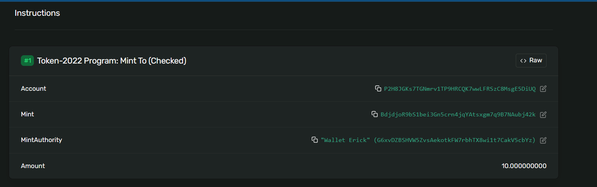
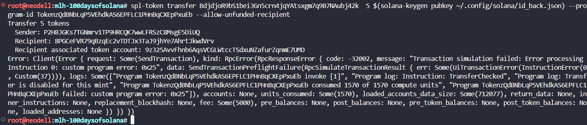
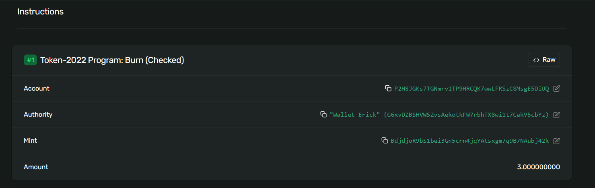

# Test token distribution strategies

## Create a non-transferable token mint.

spl-token create-token --program-id TokenzQdBNbLqP5VEhdkAS6EPFLC1PHnBqCXEpPxuEb --enable-non-transferable

Result:

```
Address:  BdjdjoR9bS1bei3Gn5crn4jqYAtsxgm7q9B7NAubj42k
Decimals:  9

Signature: 52FfGLA8UHYskSZuwzdWTMnMZnjh8sjAGmM8WT7rjjSgL5jFt6HhkvA5saowDx2cAkwvEhT4PVC9Pw1BorSxU45i
```

##  Create a token account and mint some tokens

spl-token create-account BdjdjoR9bS1bei3Gn5crn4jqYAtsxgm7q9B7NAubj42k --program-id TokenzQdBNbLqP5VEhdkAS6
EPFLC1PHnBqCXEpPxuEb

Result:

```
Creating account P2H8JGKs7TGNmrv1TP9HRCQK7wwLFRSzC8MsgE5DiUQ

Signature: 5t6y36E2UQxeV3Sr6eBVUbJAEoVGtZTVheETash9f3G6eSkeMhC2Shk88XnCRAjNZT5fKYTEQskJzhqKE3Wze6J5
```

## Create ATA in second wallet

spl-token create-account BdjdjoR9bS1bei3Gn5crn4jqYAtsxgm7q9B7NAubj42k --owner ~/.config/solana/id_back.json --fee-payer ~/.con
fig/solana/id.json --program-id TokenzQdBNbLqP5VEhdkAS6EPFLC1PHnBqCXEpPxuEb

```
Creating account 9z325AvvFhnb6AqsVCGLWtccTSdxuNZafurZqnmE7UMD

Signature: 28b5K5o9xhPmNwgUHDwHmHRXq1GwLYQpawdYH2N27PEuadDD4BLxGmJFSdVM94md1hqB1MB13uFHyD8Ycj4xuEyE
```

## Make a transfer

spl-token transfer BdjdjoR9bS1bei3Gn5crn4jqYAtsxgm7q9B7NAubj42k  5 $(solana-keygen pubkey ~/.config/solana/id_back.json) --pro
gram-id TokenzQdBNbLqP5VEhdkAS6EPFLC1PHnBqCXEpPxuEb --allow-unfunded-recipient

## Burn some tokens

spl-token burn P2H8JGKs7TGNmrv1TP9HRCQK7wwLFRSzC8MsgE5DiUQ 3 --program-id TokenzQdBNbLqP5VEhdkAS6EPFLC1PHnBqCXEpPxuEb
Burn 3 tokens

```
Burn 3 tokens
  Source: P2H8JGKs7TGNmrv1TP9HRCQK7wwLFRSzC8MsgE5DiUQ

Signature: 33uX4vtabxexV5teve7VCUbTZRcs3D3Kha3kzNz2zbJpsswRXGmdVptViDsYFFfpkLwwZCbKjb3s4dFxM3yiYT7a
```
## Result Mint - Error - Burn








