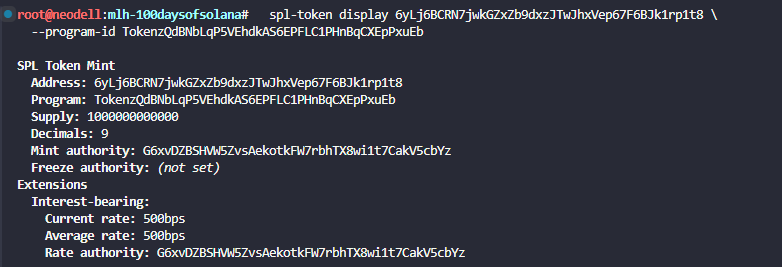
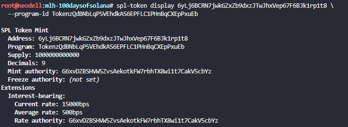

# Create an Interest-Bearing Token on Solana


## New token mint with the interest-bearing extension enabled

spl-token create-token \
  --program-id TokenzQdBNbLqP5VEhdkAS6EPFLC1PHnBqCXEpPxuEb \
  --interest-rate 500

Result:

```
Address:  6yLj6BCRN7jwkGZxZb9dxzJTwJhxVep67F6BJk1rp1t8
Decimals:  9

Signature: 2SmDYw3CuHwiY4PW4pKhnNC8otPUXXgALpVbtMZvkRxtijeLdw1VVmbL4q9y9y13JeZ9rc9aFtKZANV5B8Msstta
```

## Create a token account

spl-token create-account 6yLj6BCRN7jwkGZxZb9dxzJTwJhxVep67F6BJk1rp1t8 \
  --program-id TokenzQdBNbLqP5VEhdkAS6EPFLC1PHnBqCXEpPxuEb

Result:

```
Creating account 6ZEuiZYj7kVsu2wo9MF15E7SAi1Xa3b1qCXRKbYW6onj

Signature: 2iNxeeqULVQppMBjayLBTPKRJcfG2ZBGpnF6nFJV4uQYrZgY3Fw5Jhfq6KiWr1Xh4MvnmxYLtL54Y7Zw9nWqYWpR
```

## Mint tokens

spl-token mint 6yLj6BCRN7jwkGZxZb9dxzJTwJhxVep67F6BJk1rp1t8 1000 \
  --program-id TokenzQdBNbLqP5VEhdkAS6EPFLC1PHnBqCXEpPxuEb

Result:

```
Minting 1000 tokens
  Token: 6yLj6BCRN7jwkGZxZb9dxzJTwJhxVep67F6BJk1rp1t8
  Recipient: 6ZEuiZYj7kVsu2wo9MF15E7SAi1Xa3b1qCXRKbYW6onj

Signature: 4GygzFXQLDyDgehM44EqeVRLpf1kHCuT2zGdVPpiFJyPNcHBZUCJMtobh4Br7gAx67yeTckuamKjtuPmPinu12nK
```



