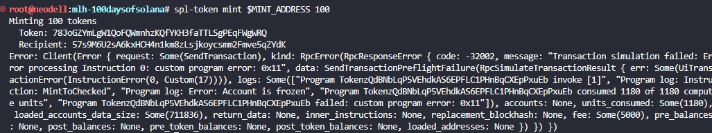
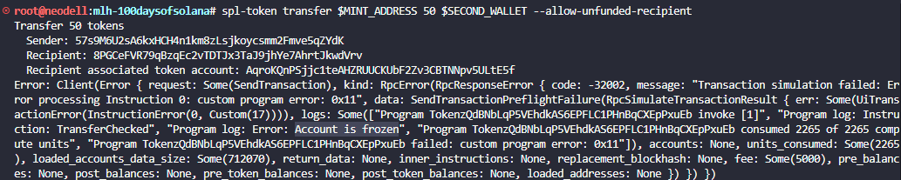
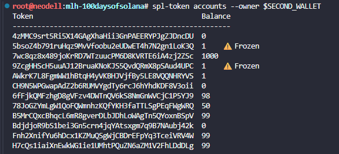

# Create a Compliance-Gated Token with Default Frozen Accounts

## Create a mint with default frozen accounts
spl-token create-token \
  --program-id TokenzQdBNbLqP5VEhdkAS6EPFLC1PHnBqCXEpPxuEb \
  --enable-freeze \
  --default-account-state frozen

Result:

```
Address:  78JoGZYmLgW1QoFQWmnhzKQfYKH3faTTLSgPEqFWgWRQ
Decimals:  9

Signature: 5uTtn6uibGh9JSo4jPeyL4NmozPiApqaWmaJN6htScRN3mvfjWTZk3vra1Rah32jZdgajfxCikvftUs3S8msKWUb
```

## Save your mint address from the output
Example: MINT_ADDRESS=78JoGZYmLgW1QoFQWmnhzKQfYKH3faTTLSgPEqFWgWRQ

## Create two token accounts
spl-token create-account $MINT_ADDRESS

Result:

```
Creating account 57s9M6U2sA6kxHCH4n1km8zLsjkoycsmm2Fmve5qZYdK

Signature: 4X9MEJK6nnmqrCWfxTBgyeYpdei9M3XMHUsgGea6gjskHbyxcHFmnCRvMY6VeXqvaaGP97MH9oootTuyvEiKuDHL
```

# Use a second keypair to simulate a second user
SECOND_WALLET=$(solana-keygen pubkey ~/.config/solana/id_back.json)

spl-token create-account $MINT_ADDRESS --owner $SECOND_WALLET --fee-payer ~/.config/solana/id.json

Result:

```
Creating account AqroKQnPSjjc1teAHZRUUCKUbF2Zv3CBTNNpv5ULtE5f

Signature: YeeTuZJRYk8mSZThSkmCLfK8vMEQ6JKfTwtDzK7nXSq3GSDL6gm4moimURMykgyJbSw2XFHBcc8n62NseYyzJoh
```

## Try to mint to your (frozen) account — this will FAIL
spl-token mint $MINT_ADDRESS 100



### You should see an error: "Account is frozen"

------------------------

## Thaw your own token account
spl-token thaw 57s9M6U2sA6kxHCH4n1km8zLsjkoycsmm2Fmve5qZYdK

Result:

```
Thawing account: 57s9M6U2sA6kxHCH4n1km8zLsjkoycsmm2Fmve5qZYdK
  Token: 78JoGZYmLgW1QoFQWmnhzKQfYKH3faTTLSgPEqFWgWRQ

Signature: 86g8rnc7HBRPz8RdaxWB5bMB9QzxpCMAW9uh7dUQjRiA2BMKdV6i1fd7AmTBjUqMrRdXpKyLGH4dNLRKz65SrW9
```

## Mint tokens to your now-thawed account
spl-token mint $MINT_ADDRESS 100

Result:

```
Minting 100 tokens
  Token: 78JoGZYmLgW1QoFQWmnhzKQfYKH3faTTLSgPEqFWgWRQ
  Recipient: 57s9M6U2sA6kxHCH4n1km8zLsjkoycsmm2Fmve5qZYdK

Signature: 22KfznEqjPktCTKh4oUoHEWU9BEiwEwv6niRJ3VucNocsyFpSP8vecS7QQQboQkAi21EEQ9PBvweHkGZgVczfZ8J
```
## Try to transfer to the second (still frozen) account — this will FAIL

spl-token transfer $MINT_ADDRESS 50 $SECOND_WALLET --allow-unfunded-recipient



### You should see an error because the destination is frozen

-------------------------------

# Thaw the second account, then transfer
spl-token thaw AqroKQnPSjjc1teAHZRUUCKUbF2Zv3CBTNNpv5ULtE5f

Result:

```
Thawing account: AqroKQnPSjjc1teAHZRUUCKUbF2Zv3CBTNNpv5ULtE5f
  Token: 78JoGZYmLgW1QoFQWmnhzKQfYKH3faTTLSgPEqFWgWRQ

Signature: 3svrGbS6qmGWK6bKXLi6XRqfCzFfiaxNZfzdtLZBBvY3ygrtUGapvm9ErJj3T4BhnjMV73v4GewQbcmhDTnGdL1i
```

spl-token transfer $MINT_ADDRESS 50 $SECOND_WALLET --allow-unfunded-recipient

Result:

```
Transfer 50 tokens
  Sender: 57s9M6U2sA6kxHCH4n1km8zLsjkoycsmm2Fmve5qZYdK
  Recipient: 8PGCeFVR79qBzqEc2vTDTJx3TaJ9jhYe7AhrtJkwdVrv
  Recipient associated token account: AqroKQnPSjjc1teAHZRUUCKUbF2Zv3CBTNNpv5ULtE5f

Signature: 5d79fXUVvEeAmrQh2WXT3tKXbuEUbCHxn3QuA7izjVA7g2XA7qWgNZiiHFmaurmTtMiw7mctfYEhraf3FyLMb652
```

## Verify balances
spl-token accounts --owner $SECOND_WALLET

