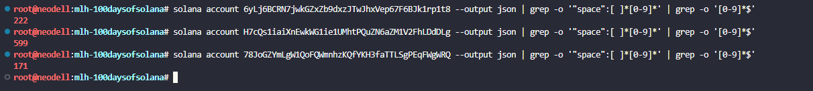

# Inspect and Compare Token Extension Configurations

spl-token display 6yLj6BCRN7jwkGZxZb9dxzJTwJhxVep67F6BJk1rp1t8 --program-id TokenzQdBNbLqP5VEhdkAS6EPFLC1PHnBqCXEpPxuEb

Result:

```
Current rate: 15000bps
```

## Inspect your multi-extension mint from Day 37

spl-token display H7cQs1iaiXnEwkWG1ie1UMhtPQuZN6aZM1V2FhLDdDLg --program-id TokenzQdBNbLqP5VEhdkAS6EPFLC1PHnBqCXEpPxuEb

## Inspect your default-frozen mint from Day 38

spl-token display 78JoGZYmLgW1QoFQWmnhzKQfYKH3faTTLSgPEqFWgWRQ --program-id TokenzQdBNbLqP5VEhdkAS6EPFLC1PHnBqCXEpPxuEb

##  Compare account sizes

One: 6yLj6BCRN7jwkGZxZb9dxzJTwJhxVep67F6BJk1rp1t8

```
solana account 6yLj6BCRN7jwkGZxZb9dxzJTwJhxVep67F6BJk1rp1t8 --output json | grep -o '"space":[ ]*[0-9]*' | grep -o '[0-9]*$'
```

Multi: H7cQs1iaiXnEwkWG1ie1UMhtPQuZN6aZM1V2FhLDdDLg

```
solana account H7cQs1iaiXnEwkWG1ie1UMhtPQuZN6aZM1V2FhLDdDLg --output json | grep -o '"space":[ ]*[0-9]*' | grep -o '[0-9]*$'
```

Frozen: 78JoGZYmLgW1QoFQWmnhzKQfYKH3faTTLSgPEqFWgWRQ

```
solana account 78JoGZYmLgW1QoFQWmnhzKQfYKH3faTTLSgPEqFWgWRQ --output json | grep -o '"space":[ ]*[0-9]*' | grep -o '[0-9]*$'
```
Result:

