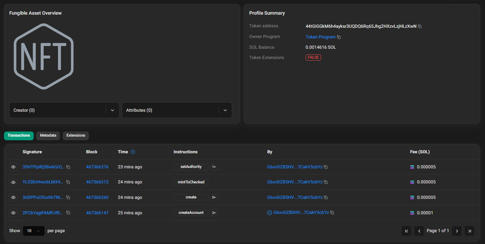

# Mint a 1-of-1 SPL token and meet your first NFT

## The Challenge

You are going to create a brand new mint on devnet, configure it so only a single indivisible unit can ever exist, mint that one unit to your wallet, and then permanently disable the ability to ever create another. Then you will look it up on Solana Explorer and see it labeled as a Non-Fungible Token. No JSON metadata yet. No Metaplex. Just the raw on-chain reality of what makes a token “non-fungible” in the first place.


spl-token create-token --decimals 0

Result:

```
Address:  44tGiGGkM6h4ayksr3UQDQ6Rq65Jhg2HXzvLzjHLzXwN
Decimals:  0

Signature: 2PCbYagtFkMPJfRq25Mzsf6VNovKhwcvJHWeaQC573hXReJiCjqTqZDz4kHvbkhzmCvbDa9fPN4uEFtgFZsvaisr
```

spl-token create-account $YOUR_MINT_ADDRESS

Result:

```
Creating account BeQXYADzjKE8jQGQnRqihKdW3CGCSezzXZ4gvjBxCYpH

Signature: 3nDPPuCRzxhh7NiBWNf6KKeK2GwtPMY42LkVyz2MHVSCPwGf3KpXZ1q5AjNxH9pJXWj7zE3b49Q4VH7Yw2NMQm3i
```


spl-token mint $YOUR_MINT_ADDRESS 1

Result:

```
Minting 1 tokens
  Token: 44tGiGGkM6h4ayksr3UQDQ6Rq65Jhg2HXzvLzjHLzXwN
  Recipient: BeQXYADzjKE8jQGQnRqihKdW3CGCSezzXZ4gvjBxCYpH

Signature: YLS3DrHwo6LMX44hhnwUp3xC9ATKphtQNwAckxHbWyeLhU5VgqWNHmhbiSCKeRkoVE71G1tcnQQ5XaUMgpHCZH9
```

spl-token authorize $YOUR_MINT_ADDRESS mint --disable

Result:

```
Updating 44tGiGGkM6h4ayksr3UQDQ6Rq65Jhg2HXzvLzjHLzXwN
  Current mint: G6xvDZBSHVW5ZvsAekotkFW7rbhTX8wi1t7CakV5cbYz
  New mint: disabled

Signature: 35HTPpiRj5BwkGrQgC1YAvfJX4vMoDcaH1djtWaKDEw19ryeZHB98s1kWf7WGhMgXstQn1TnhitiQuyTZvJoWJ6u
```

spl-token supply $YOUR_MINT_ADDRESS

Result: ``` 1 ```

### https://solscan.io/token/44tGiGGkM6h4ayksr3UQDQ6Rq65Jhg2HXzvLzjHLzXwN?cluster=devnet

