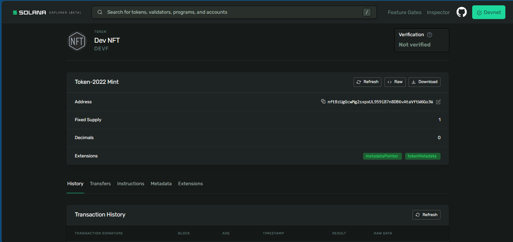

# Give your NFT a name, an image, and on-chain metadata

## Generate a vanity-friendly mint keypair
solana-keygen grind --starts-with nft:1

## Create the mint with the metadata extension turned on

spl-token create-token \
  --program-id TokenzQdBNbLqP5VEhdkAS6EPFLC1PHnBqCXEpPxuEb \
  --enable-metadata \
  --decimals 0 \
  ./nftBzUgGcwMg2sxpxUL959iB7n8DB6vAtaVftW6Go3W.json

Result:

```
Address:  nftBzUgGcwMg2sxpxUL959iB7n8DB6vAtaVftW6Go3W
Decimals:  0
```
## Initialize the on-chain metadata fields

spl-token initialize-metadata \
  $YOUR_MINT_ADDRESS \
  "Dev NFT" \
  "DEVF" \
  "https://gist.githubusercontent.com/neocarvajal/2211b1df817656f2ad44d5289a3b52fc/raw/7f1da428ec33b3c24c8d3a75462efbc9f14b9721/metadata.json"

Result:

```
Signature: 3Mc8RKX4TXxGr8UELiENE9MVy6PkTNWG5McdixGzo7AjiCNmheezpmpAGLFhsk45JHyZPcE38LgSDnseoztf3rQa
```

## Create your associated token account and mint exactly one unit

spl-token create-account $YOUR_MINT_ADDRESS

Result:

```
Creating account AXxhccijkPcgiUnAw2AT9MEixFxamz6EZQprjDzTzBKT

Signature: YJqvj3W596Cr9jRZbK1syvVzdKRNm1tDAPj9gbG8FbqdXTZKbrry11HzypUniGjSiWFecxdbgi5SXdnreABvQ7i
```

spl-token mint $YOUR_MINT_ADDRESS 1

Result:

```
Minting 1 tokens
  Token: nftBzUgGcwMg2sxpxUL959iB7n8DB6vAtaVftW6Go3W
  Recipient: AXxhccijkPcgiUnAw2AT9MEixFxamz6EZQprjDzTzBKT

Signature: 2UA1LCsXNSWtg9Ku7trGAjsGAjLJXoQWTXAnPP8gw3DqveCmAPz6f2tXH3vMCXD4yAESdiG5VC8GHvtmuE366GnY
```

## Lock the supply forever by disabling the mint authority

spl-token authorize $YOUR_MINT_ADDRESS mint --disable

Result:

```
Updating nftBzUgGcwMg2sxpxUL959iB7n8DB6vAtaVftW6Go3W
  Current mint: G6xvDZBSHVW5ZvsAekotkFW7rbhTX8wi1t7CakV5cbYz
  New mint: disabled

Signature: 3UbMi18dwBDPCdW7Z2e1ZNF6AiwzPzup4A6sKcLW8TxXpetkhaFGa4YKu51TyKTi1BEaVs7xZ1mWzr4QRibs3WcK
```



https://explorer.solana.com/address/nftBzUgGcwMg2sxpxUL959iB7n8DB6vAtaVftW6Go3W?cluster=devnet