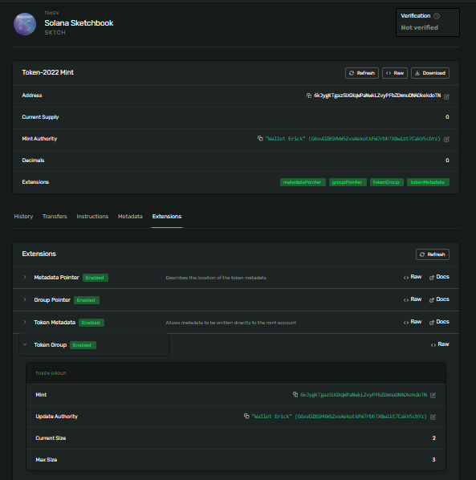

# Group your NFTs into an on-chain collection

## Create the collection mint with the group extension

spl-token --program-id TokenzQdBNbLqP5VEhdkAS6EPFLC1PHnBqCXEpPxuEb create-token \
  --decimals 0 \
  --enable-metadata \
  --enable-group

Result:

```
Address:  6kJygKTgazSUGXqWPaNwkLZvyPFbZDmnuDNADkekdoTN
Decimals:  0

Signature: 5jdiaQFsmPZKL5yE7Dy7ujzeDTTha4M3NuW6ca4KcHRzA7Z48nPhW511R6WHQm4HQ8UPYmVkkzTw6LBdKZgevmq4
```

## Stamp the collection with metadata

spl-token initialize-metadata $COLLECTION_MINT \
  "Solana Sketchbook" \
  "SKTCH" \
  "https://gist.githubusercontent.com/janvinsha/b477ebe4dda46b0ef03895c4ea930a46/raw/f29222bcaff0d4979fe7ebb610a00bb97a8418ec/collection.json"

Result:

```
Signature: DmWevFtvH3CXDNGfmugx82pvsrskmLFPB2T1B3tNR7pFbxrmfdKn4qJq6BxvW79z84bjQL8QuoCcrTJW7eC8o3z
```
## Initialize the group

spl-token initialize-group $COLLECTION_MINT 3

Result:

```
Signature: JNVxKPJY8sFZPCN2gqLMXU9M7T73uawWAyWUee1BTF8zvjXF86Mm94BfXnC1ZB6nYwEd8xqKUMbCUJEmkphZPZE
```
## Create the first member mint

spl-token --program-id TokenzQdBNbLqP5VEhdkAS6EPFLC1PHnBqCXEpPxuEb create-token \
  --decimals 0 \
  --enable-metadata \
  --enable-member

Result:

```
Address:  6vXMhusNYH5miTfWmnY6AfjksfV59YFJYZoAgmAWKcPq
Decimals:  0

Signature: 2ojtXtQzNmzoN4buSPQsC6J2TRERiCzvVXkHtKLe9xHURyrixZgN5vt7R8eBXoBr3oFsMBFtdQsJ5cuj1WMRTYnb
```
## Stamp the first member with its own metadata

spl-token initialize-metadata $MEMBER_ONE_MINT \
  "Sketch #1" \
  "SK1" \
  "https://gist.githubusercontent.com/janvinsha/3412c5d4e92b6de9a2ed82337ecafc44/raw/99359fc62ffd0480b6a52ee1ad4048ecba4ae61c/nft.json"

Result:

```
Signature: 2CqU7rvjTgEGWVeutntRsVNMDJ9ZLFZPJGmH9p97M6EznTD2EusTLwbDL7FwtZGuBNPgJmiSeQkPt9SHX4FeGTQA
```

## Link the member to the collection

spl-token initialize-member $MEMBER_ONE_MINT $COLLECTION_MINT

Result:

```
Signature: 2du1jbdhw92puQL9kS5dLsKvNHBkrtiVKt2ubEzbbgFiq4UbGzACwCZMVyUURLxHbVXYvYLePVRzizpPT9U3oBwt
```

## Mint exactly one of the first NFT and lock supply

spl-token create-account $MEMBER_ONE_MINT

Result:

```
Creating account G67YQELefL6Yb8nyo9fH9KkDpanv1JVCxcVptmedDudL

Signature: aUsGpKbg78WRn4UVAYRq4YuUwWWuJ5cc7FUJSSQmEBoCnED6UCVucj8jKLrFkTEnCHULXuehowoo9s4JkdJmwHS
```

spl-token mint $MEMBER_ONE_MINT 1

Result:

```
Minting 1 tokens
  Token: 6vXMhusNYH5miTfWmnY6AfjksfV59YFJYZoAgmAWKcPq
  Recipient: G67YQELefL6Yb8nyo9fH9KkDpanv1JVCxcVptmedDudL

Signature: 5PnDDqE2Uh1qw4Mz6ozX1yRJvnCci9KVTsbuLRD61CJpHRdN9iMPWMNUxWuHWJxoiprRA8QoT6WsZ3ipNuq94x4k
```

spl-token authorize $MEMBER_ONE_MINT mint --disable

Result:

```
Updating 6vXMhusNYH5miTfWmnY6AfjksfV59YFJYZoAgmAWKcPq
  Current mint: G6xvDZBSHVW5ZvsAekotkFW7rbhTX8wi1t7CakV5cbYz
  New mint: disabled

Signature: yeh16TZUzYzgf9V2TE92sz3VsHaGpJCV2tgK1EVgB1wmPro3XqthGpaDZceMaWKgkVnN4bUiCKBxzDJtU6yLoWn
```

### Repeat steps 5 through 8 for a second member NFT

View the collection on Solana Explorer. Open three tabs

https://explorer.solana.com/address/6kJygKTgazSUGXqWPaNwkLZvyPFbZDmnuDNADkekdoTN?cluster=devnet

https://explorer.solana.com/address/6vXMhusNYH5miTfWmnY6AfjksfV59YFJYZoAgmAWKcPq?cluster=devnet

https://explorer.solana.com/address/C1Xpafhhv2Sh4Qsp6UDyvhaqiM7Koya44gCVpDMot4co?cluster=devnet

