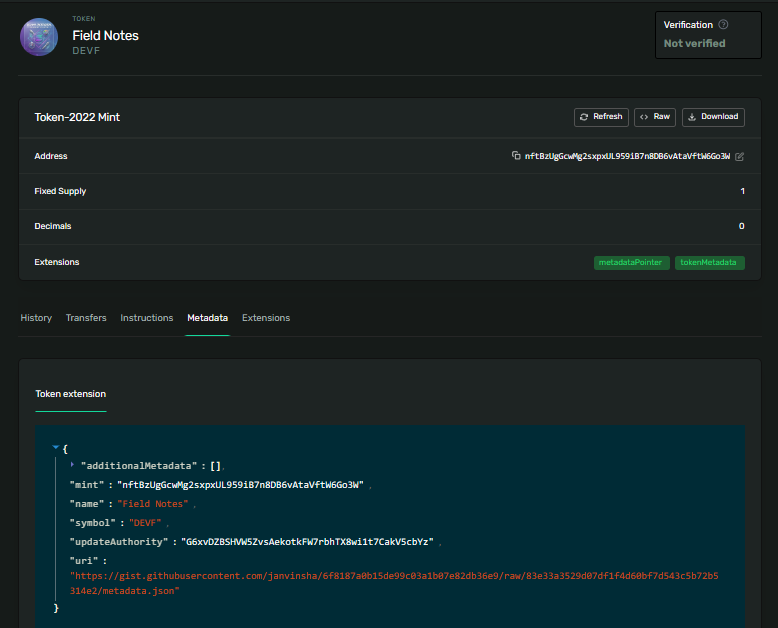

# Mutate your NFT's metadata live on devnet

nftBzUgGcwMg2sxpxUL959iB7n8DB6vAtaVftW6Go3W

## Update name field

spl-token update-metadata $MINT_ADDRESS name "Field Notes"

Result:

```
Signature: 3XiegXF8XmpsAX6hNALiSXozbStwPASd7mkMtf2mTajNgCRwU1ThdAvzn837sq8jLuC7jeZfdoPRvjyfXPsmsj4c
```

## Add a custom additional metadata field

spl-token update-metadata $MINT_ADDRESS rarity legendary

Result:

```
Signature: 4XQ4dAq8PJd6oPbEWeSN4UktQbeaKLCyvoWRd739Y4AXermYMA79ivWr3d639HyDR4W29joShbbJhXoxhB8xm5da
```

## Remove that custom field

spl-token update-metadata $MINT_ADDRESS rarity --remove

Result:

```
Signature: 3npWGS2qeMmWt62NmdQXavjpFcYAkApVakbgbE9aULtUK6EboxgYmYwkxayaMhjfLWKwUkKka2Je6yBDQWCUAPKc
```

# Point the NFT at a new metadata JSON

spl-token update-metadata $MINT_ADDRESS uri https://gist.githubusercontent.com/janvinsha/6f8187a0b15de99c03a1b07e82db36e9/raw/83e33a3529d07df1f4d60bf7d543c5b72b5314e2/metadata.json

Result:

```
Signature: e8oFJJWMvouEFq6ZYphihXa2wq9Y2xTjUHetpgW62jCqWQCyjNLR7J37nSQEk7TEy8G4tpSNRAWxJLVzmCjANar
```


