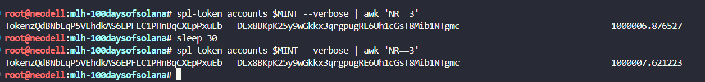

# Stack interest accrual on top of your fee-bearing token


Create a brand new mint that combines two extensions in a single invocation. The --transfer-fee-basis-points flag sets the fee rate and --transfer-fee-maximum-fee sets the maximum raw fee per transfer. The --interest-rate flag takes a single integer in basis points, where 10000 basis points equals 100 percent APR. To make the interest visible inside one coffee break, use an unrealistically high rate.

```javascript
spl-token create-token \
  --program-id TokenzQdBNbLqP5VEhdkAS6EPFLC1PHnBqCXEpPxuEb \
  --decimals 6 \
  --transfer-fee-basis-points 100 \
  --transfer-fee-maximum-fee 1000000 \
  --interest-rate 5000
```

```
Result: 7LaHSfWwPprbaQAYJnFePpVxT5brDAMtNP1hFL4UbkEt

Signature: 2WB2VRHf5RmppWii5QH7gnv8BrsoMjDJYFVcMdbE3iNg6UCKmdrbHQiNfjEqsFuhDAQbupQ5Fk9Rs6XrDFhBGPLm
```

MINT=7LaHSfWwPprbaQAYJnFePpVxT5brDAMtNP1hFL4UbkEt

Display the mint and read every line of the output. You should see TransferFeeConfig AND InterestBearingConfig populated. Confirm both extensions made it onto the same TLV (type-length-value) blob inside the mint account.

```javascript
spl-token display $MINT
```

Create an associated token account for yourself on the new mint, then mint a generous supply so the interest math produces visible digits.

```javascript
spl-token create-account $MINT
```

```
Result: DLx8BKpK25y9wGkkx3qrgpugRE6Uh1cGsT8Mib1NTgmc

Signature: 2THUeDbuZjsDRr3g9bWwFwjB3Mye99NeDyVqibPXYJXiXCz4vKif9eYftFPH8r3fgnFFNeVEfUTyktNoEUZJhh4q
```

```javascript
MY_TA=DLx8BKpK25y9wGkkx3qrgpugRE6Uh1cGsT8Mib1NTgmc

spl-token mint $MINT 1000000
```

```
Result:

Minting 1000000 tokens
  Token: 7LaHSfWwPprbaQAYJnFePpVxT5brDAMtNP1hFL4UbkEt
  Recipient: DLx8BKpK25y9wGkkx3qrgpugRE6Uh1cGsT8Mib1NTgmc

Signature: 2yedK75ahv655FkQa4qyj1Pz2cgH9FR58QYYDNSpQLNMhGRFtUgb8SFUaD8pRWdTnHoFHDuaEs6dByoyTbiJV5qD
```

Run spl-token accounts on your token account and write down the UI amount. Wait roughly 30 seconds. Run it again. Write down the new UI amount. The numbers should be different even though you have not sent a transaction in between.

```javascript
spl-token accounts $MINT --verbose | awk 'NR==3'
sleep 30
spl-token accounts $MINT --verbose | awk 'NR==3'
```



Now move some tokens. Generate a fresh keypair, fund it with a tiny amount of SOL from your wallet, and transfer a chunk of your token supply to it. Use the --expected-fee flag the same way you did on Day 51 so the transfer instruction acknowledges the fee.
Display the recipient’s token account. Confirm two things at once. First, the fee was withheld on the recipient side, exactly like it did on Day 51. Second, the recipient’s UI amount is already drifting upward because the interest-bearing extension applies to every account on the mint, not just yours.

```javascript
solana-keygen new --no-bip39-passphrase --outfile ~/recipient.json
RECIPIENT=$(solana-keygen pubkey ~/recipient.json)
solana transfer $RECIPIENT 0.01 --allow-unfunded-recipient
```

```
Result: 

Signature: 3bYRKEaTWDgF9eN8Fu64dyrji3XUTYRwweBpLdVqTJj2ts96n17PcP127puxxY8mQQHiHNZDQ8rMLzSMUNdnAJmn
```

```javascript
spl-token create-account $MINT --owner $RECIPIENT --fee-payer ~/.config/solana/id.json
```

```
Result:

Creating account 33okpThHLYbXfd4hP3PpvaroTekjBDyayQFaEdw4Y1kY

Signature: Dv7cb63mQWTDTpnzK1feSxhzwfvuuoBBEtqLJdc7SdwV5gPqygn98vuUNkhEZsDuP1Xbdgx5yBWDDJqp9eaBiTY
```

```javascript
The line above prints the recipient's new token account address.
Paste it here so the next steps can reuse it:

RECIPIENT_TA=33okpThHLYbXfd4hP3PpvaroTekjBDyayQFaEdw4Y1kY
```

```javascript
spl-token transfer $MINT 1000 $RECIPIENT \
  --expected-fee 10
```

```
Result:

Transfer 1000 tokens
  Sender: DLx8BKpK25y9wGkkx3qrgpugRE6Uh1cGsT8Mib1NTgmc
  Recipient: 5Myedv5puivjsU5jdNmUzaZUoXdBwYiwxGC19xeiScWr
  Recipient associated token account: 33okpThHLYbXfd4hP3PpvaroTekjBDyayQFaEdw4Y1kY

Signature: UcEftB3a8k2a2Hu3218Vc6GXTjQMK6dYwtc2pB622ztjkjiQv98MHzchDswfmtGk4NcDkoPvNHwK1C47nBvAfVa
```

```javascript
spl-token display $RECIPIENT_TA
```

As a final check, withdraw the withheld fees back to your wallet using the same withdraw-withheld-tokens flow from yesterday. Confirm that your mint authority still works on a multi-extension mint.

```javascript
spl-token withdraw-withheld-tokens $MY_TA $RECIPIENT_TA
```

```
Result:

Signature: 5m515wZAHtTpVVBxUufR2yv8RBA6qiY5oRMXVpdJV7oRKhAZ2FrWgykL9dREnDTrApLX4yLmiSbCq96YnqxyUtB3
```