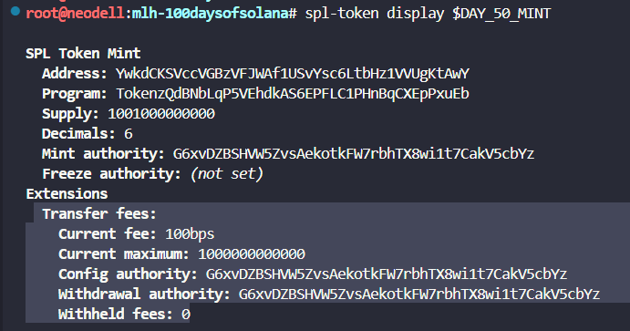
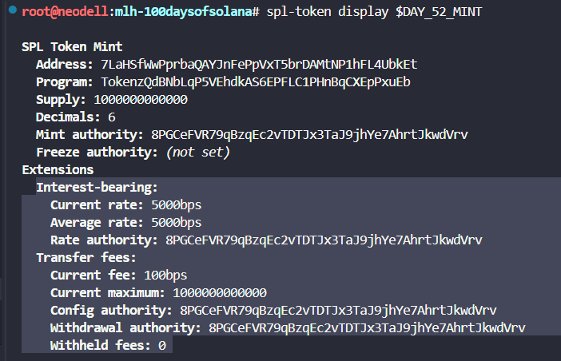

# Audit your three Token-2022 mints and map every extension you have shipped

Find the two mint addresses from your previous days. They were printed in the terminal when you ran spl-token create-token, and they were echoed by every follow up command. If you lost them, scroll back through the terminal history or check your wallet’s devnet token list.

```javascript
DAY_50_MINT=YwkdCKSVccVGBzVFJWAf1USvYsc6LtbHz1VVUgKtAwY

DAY_52_MINT=7LaHSfWwPprbaQAYJnFePpVxT5brDAMtNP1hFL4UbkEt
```


Run spl-token display against your Day 50 mint. The CLI auto-detects that this mint lives under the Token-2022 program and prints the mint authority, the decimals, the supply, and a section listing every configured extension.

```javascript
spl-token display $DAY_50_MINT
```

Read the extensions block carefully. For the Day 50 mint you should see a TransferFeeConfig entry (with the basis points and maximum fee you set).


Run spl-token display against your Day 52 mint. This is the stacked one.

```javascript
spl-token display $DAY_52_MINT
```

Read this extensions block and confirm it has everything from the Day 50 mint plus an InterestBearingConfig entry showing the annual rate in basis points and the timestamp the rate was last updated.

```
Transfer Fees: This extension makes the mint collect a fee on every token transfer and allows the accumulated fees to be withdrawn by the designated authority.

InterestBearingConfig: This extension makes token balances earn interest over time at a configurable annual rate measured in basis points.
```

Take a screenshot of both display outputs side by side or stacked vertically. Highlight the extensions block on each if your screenshot tool supports it.



=====

