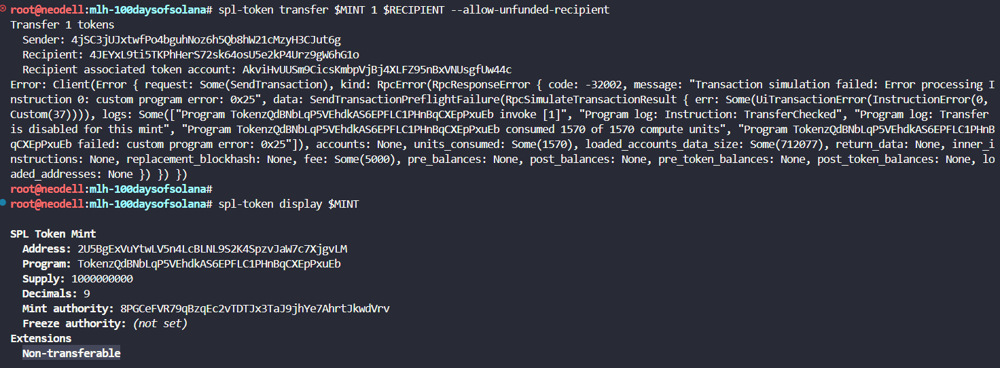

# Make a token that refuses to move

Create a brand new mint with the non-transferable extension turned on. This is a one-shot flag on the create-token subcommand. Keep the mint address handy, you will need it for the next three steps.

```javascript
spl-token create-token --program-2022 --enable-non-transferable
```

```
Result:
Creating token 2U5BgExVuYtwLV5n4LcBLNL9S2K4SpzvJaW7c7XjgvLM under program TokenzQdBNbLqP5VEhdkAS6EPFLC1PHnBqCXEpPxuEb

Address:  2U5BgExVuYtwLV5n4LcBLNL9S2K4SpzvJaW7c7XjgvLM
Decimals:  9

Signature: 4H4otZ46MnRPbyiGhc38KeLcNpEfEvHR2ZNTQWEspX6MxcUkcJrWVCiDivEmuJHkRaa7aG4oJEWFuqzwbq5d1jZf

```

```javascript
MINT=2U5BgExVuYtwLV5n4LcBLNL9S2K4SpzvJaW7c7XjgvLM
```

Create an associated token account for that mint under your own wallet. This is the only account that will ever hold a balance of this token, and you will see why in a moment.

```javascript
spl-token create-account $MINT
```

```
Result:

Creating account 4jSC3jUJxtwfPo4bguhNoz6h5Qb8hW21cMzyH3CJut6g

Signature: 1aWFVjAxUdJpzxPK3niTSfc22E5mpZ2Mtz8PrYDdyWLfdXZDLxyJx5d4P8j7uu3QZeEHSQMCPK2YaLkuBGXm6y5
```

```javasript
MY_TA=4jSC3jUJxtwfPo4bguhNoz6h5Qb8hW21cMzyH3CJut6g
```

Mint exactly one unit of the token into your own account. Treat it like awarding yourself a badge.

```javascript
spl-token mint $MINT 1
```

```
Result:

Minting 1 tokens
  Token: 2U5BgExVuYtwLV5n4LcBLNL9S2K4SpzvJaW7c7XjgvLM
  Recipient: 4jSC3jUJxtwfPo4bguhNoz6h5Qb8hW21cMzyH3CJut6g

Signature: kBB411qm28AEQSV7Z4vufu7qsJMRcuoHFWejuaUE4PsmDRjMH6PnmUVb9cU3Puqq2jKSA8TApiMpvskT7hTAjxb
```

Generate a throwaway recipient keypair so you have a second address to aim at. You do not need to fund it for this experiment, you only need its public key.

```javascript
solana-keygen new --no-bip39-passphrase --outfile day-54/recipient.json --force 
RECIPIENT=$(solana-keygen pubkey day-54/recipient.json)
```

Create the recipient’s associated token account first, paying the rent yourself since the throwaway wallet has no SOL. Then attempt to transfer your one token to it. Creating the account up front means the transfer actually reaches the program and is refused by the extension, instead of being refused by the CLI for an unrelated reason like a missing or unfunded destination account.

```javascript
spl-token create-account $MINT --owner $RECIPIENT --fee-payer ~/.config/solana/id.json
```

```
Result:
Creating account AkviHvUUSm9CicsKmbpVjBj4XLFZ95nBxVNUsgfUw44c

Signature: 4WBKF5fz3DCjcTYW2NqZuA37aNacA5WCDdyMm4VY3h6G6X6HMxFRAXgq3xz9DC8355xzXH9mgDHwHRyoj3W7HG2p
```

```javascript
spl-token transfer $MINT 1 $RECIPIENT --allow-unfunded-recipient
```

Read the error carefully. Note which program returned it and which instruction failed. This is the moment the extension earns its name.

```
Transfer 1 tokens
  Sender: 4jSC3jUJxtwfPo4bguhNoz6h5Qb8hW21cMzyH3CJut6g
  Recipient: 4JEYxL9ti5TKPhHerS72sk64osU5e2kP4Urz9gW6hG1o
  Recipient associated token account: AkviHvUUSm9CicsKmbpVjBj4XLFZ95nBxVNUsgfUw44c
Error: Client(Error { request: Some(SendTransaction), kind: RpcError(RpcResponseError { code: -32002, message: "Transaction simulation failed: Error processing Instruction 0: custom program error: 0x25", data: SendTransactionPreflightFailure(RpcSimulateTransactionResult { err: Some(UiTransactionError(InstructionError(0, Custom(37)))), logs: Some(["Program TokenzQdBNbLqP5VEhdkAS6EPFLC1PHnBqCXEpPxuEb invoke [1]", "Program log: Instruction: TransferChecked", "Program log: Transfer is disabled for this mint", "Program TokenzQdBNbLqP5VEhdkAS6EPFLC1PHnBqCXEpPxuEb consumed 1570 of 1570 compute units", "Program TokenzQdBNbLqP5VEhdkAS6EPFLC1PHnBqCXEpPxuEb failed: custom program error: 0x25"]), accounts: None, units_consumed: Some(1570), loaded_accounts_data_size: Some(712077), return_data: None, inner_instructions: None, replacement_blockhash: None, fee: Some(5000), pre_balances: None, post_balances: None, pre_token_balances: None, post_token_balances: None, loaded_addresses: None }) }) })
```

For one last sanity check, run spl-token display against your mint and confirm the non-transferable line is present in the output. Yesterday you learned how to read that output, so today it should feel routine.

```javascript
spl-token display $MINT
```

failed transfer error alongside the spl-token display output that confirms the non-transferable extension is active on the mint

